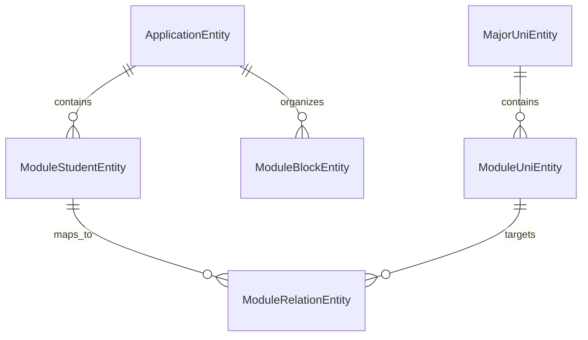

# SWTP-04: Module Credit Recognition System

A comprehensive web application for module credit recognition at Leipzig University, built with modern microservices architecture and containerized deployment.

## 📋 Table of Contents
- [🎯 Overview](#🎯 overview)
- [📊 Business Workflow](#📊 business-workflow)
- [🏗️ Architecture](#🏗️ architecture)
- [🛠️ Technology Stack](#🛠️ technology-stack)
- [🚀 Getting Started](#🚀 getting-started)
- [💻 Development Guide](#💻 development-guide)
- [📚 API Documentation](#📚 api-documentation)
- [🗄️ Database Schema](#🗄️ database-schema)
- [🔐 Authentication & Authorization](#🔐 authentication--authorization)
- [⚙️ Configuration](#⚙️ configuration)
- [🧪 Testing](#🧪 testing)
- [🚢 Deployment](#🚢 deployment)
- [🔧 Troubleshooting](#🔧 troubleshooting)
- [🛡️ Security Considerations](#🛡️ security-considerations)
- [📈 Performance & Scalability](#📈 performance--scalability)
- [🤝 Contributing](#🤝 contributing)

## 🎯 Overview

This web application facilitates the module credit recognition process at Leipzig University. It provides a streamlined workflow for students to submit credit recognition applications and for university staff to review and approve them through a multi-stage approval process.

### Key Features
- **Multi-role System**: Student, Student Affairs Office, and Examining Committee interfaces
- **Application Workflow**: Complete lifecycle from submission to approval
- **PDF Processing**: Automated document handling, storage, and summary generation
- **Multi-language Support**: Full internationalization with 10 languages
- **Secure Authentication**: JWT-based authentication with role-based access control
- **Real-time Status Updates**: Live application status tracking
- **Responsive Design**: Mobile-friendly interface built with Vuetify
- **Audit Trail**: Complete application history and change tracking

## 📊 Business Workflow

### Application Lifecycle
1. **Student Submission**: Students submit module credit recognition applications with supporting documents
2. **Office Review**: Student Affairs Office reviews applications for completeness and formal requirements
3. **Committee Approval**: Examining Committee evaluates academic merit and makes final decisions
4. **Status Updates**: Real-time notifications and status updates throughout the process
5. **PDF Generation**: Automated generation of approval/rejection summaries

### User Roles & Permissions
- **Students**: Submit applications, view status, download summaries
- **Student Affairs Office**: Review applications, formal approval/rejection, prepare for committee
- **Examining Committee**: Final academic approval/rejection, course equivalency decisions

### Application States
- `open` - Initial submission
- `edited` - Modified by office
- `formally rejected` - Rejected due to formal issues
- `ready for approval` - Prepared for committee review
- `edited approval` - Modified by committee
- `approved` - Final approval
- `rejected` - Final rejection

## 🏗️ Architecture

The application follows a microservices architecture with clear separation of concerns:


### System Components

#### Frontend (Vue.js)
- **Views**: Role-specific interfaces for different user types
- **Components**: Reusable UI components for forms, tables, and navigation
- **Services**: API communication layer with axios
- **Store**: Centralized state management with Vuex
- **Routing**: Client-side routing with Vue Router
- **Internationalization**: Multi-language support with Vue I18n

#### Backend (Spring Boot)
- **Controllers**: REST API endpoints for client communication
- **Services**: Business logic and core functionality
- **Repositories**: Data access layer with JPA/Hibernate
- **Security**: JWT authentication and role-based authorization
- **Data Transfer Objects**: Structured data exchange between layers
- **Exception Handling**: Centralized error management

#### Database (PostgreSQL)
- **Normalized Schema**: Optimized for data integrity and performance
- **Entity Relationships**: Complex relationships between applications, modules, and users
- **Audit Logging**: Change tracking and history maintenance

## 🛠️ Technology Stack

### Frontend Stack
```json
{
  "framework": "Vue.js 3.2.13",
  "ui": "Vuetify 3.4.0",
  "state": "Vuex 4.1.0",
  "routing": "Vue Router 4.2.5",
  "http": "Axios 1.6.2",
  "i18n": "Vue I18n 9.7.0",
  "testing": "Vitest 0.34.6",
  "linting": "ESLint 8.0.0"
}
```

### Backend Stack
```xml
<dependencies>
  <spring-boot>3.2.0</spring-boot>
  <java>17</java>
  <spring-security>JWT-based</spring-security>
  <spring-data-jpa>3.2.0</spring-data-jpa>
  <postgresql>runtime</postgresql>
  <h2>test-scope</h2>
  <lombok>optional</lombok>
  <modelmapper>3.1.1</modelmapper>
  <pdfbox>2.0.29</pdfbox>
</dependencies>
```

### Infrastructure
- **Containerization**: Docker & Docker Compose
- **Reverse Proxy**: Nginx
- **CI/CD**: GitLab CI/CD with automated testing and deployment
- **Monitoring**: Application-level logging with SLF4J

## 🚀 Getting Started

### Prerequisites
- **Docker Desktop**: [Install Docker](https://www.docker.com/products/docker-desktop/)
- **Node.js 18+**: [Install Node.js](https://nodejs.org/) (for local development)
- **Java 17**: [Install Java 17](https://openjdk.org/projects/jdk/17/) (for backend development)
- **Maven 3.8+**: Included with Maven Wrapper

### Quick Start with Docker

1. **Clone the repository**
   ```bash
   git clone <repository-url>
   cd swtp-hc
   ```

2. **Environment Setup**
   ```bash
   # Copy environment templates (if needed)
   cp .env.example .env
   ```

3. **Start the application stack**
   ```bash
   # Start all services
   docker-compose up --build
   
   # Start in detached mode
   docker-compose up -d --build
   ```

4. **Access the application**
   - **Frontend**: http://localhost:3000
   - **Backend API**: http://localhost:3001
   - **Database**: localhost:5432

5. **Default Test Accounts**
   - **Student Affairs Office**: `office` / `pw_office`
   - **Examining Committee**: `committee` / `pw_committee`

### Service Configuration
```yaml
# docker-compose.yml structure
services:
  frontend:    # Vue.js + Nginx (Port 3000)
  backend:     # Spring Boot (Port 3001)
  postgres:    # PostgreSQL (Port 5432)
```

## 💻 Development Guide

### Frontend Development

1. **Setup Development Environment**
   ```bash
   cd frontend
   npm install
   ```

2. **Development Server**
   ```bash
   npm run serve  # Hot-reload development server
   ```

3. **Build for Production**
   ```bash
   npm run build
   npm run lint
   ```

4. **Project Structure**
   ```
   frontend/
   ├── src/
   │   ├── components/     # Reusable UI components
   │   ├── views/          # Page-level components
   │   ├── services/       # API service layer
   │   ├── store/          # Vuex store modules
   │   ├── router/         # Vue Router configuration
   │   ├── locale/         # Internationalization files
   │   └── assets/         # Static assets
   └── public/             # Public assets
   ```

### Backend Development

1. **Setup Development Environment**
   ```bash
   cd backend
   ./mvnw clean install
   ```

2. **Run Development Server**
   ```bash
   ./mvnw spring-boot:run
   # Or with specific profile
   ./mvnw spring-boot:run -Dspring-boot.run.profiles=dev
   ```

3. **Project Structure**
   ```
   backend/src/main/java/com/swtp4/backend/
   ├── controller/         # REST API endpoints
   ├── services/          # Business logic
   ├── repositories/      # Data access layer
   │   ├── entities/      # JPA entities
   │   ├── dto/           # Data transfer objects
   │   └── applicationDtos/ # Application-specific DTOs
   ├── security/          # Authentication & authorization
   ├── DataInitializer/   # Test data initialization
   ├── Deserializer/      # JSON deserialization
   └── exception/         # Custom exception handling
   ```

### Hot Reloading Setup
```bash
# Frontend hot reload
cd frontend && npm run serve

# Backend hot reload (with spring-boot-devtools)
cd backend && ./mvnw spring-boot:run
```

## 📚 API Documentation

### Authentication Endpoints
```http
POST /api/auth/authenticate
Content-Type: application/json

{
  "username": "office",
  "password": "pw_office"
}
```

### Student Endpoints
```http
# Submit new application
POST /api/student/submitApplication
Content-Type: multipart/form-data

form: SubmittedApplicationDto
files: Map<String, MultipartFile>

# Review application status
GET /api/student/reviewApplication?applicationID={id}

# Download PDF summary
GET /api/student/getPdfSummary?applicationId={id}
```

### Application Management Endpoints
```http
# Get paginated applications (Office)
GET /api/application/overviewOffice?page=0&size=10&sort=dateOfSubmission,asc

# Get paginated applications (Committee)
GET /api/application/overviewCommittee?page=0&size=10

# Get specific application
GET /api/application/getApplication?applicationID={id}

# Save edited application
PUT /api/application/saveEdited
Content-Type: application/json

# Formal rejection
PUT /api/application/formalRejection

# Ready for approval
PUT /api/application/readyForApproval

# Save approval (Committee only)
PUT /api/application/saveApproval
Authorization: Bearer {jwt-token}

# Download module PDF
GET /api/application/getModulePDF?filePath={path}
```

### University Data Endpoints
```http
# Get all majors
GET /api/uniData/majors

# Get modules for major
GET /api/uniData/modules?majorName={name}

# Update university data (Admin only)
PUT /api/uniData/updateUniData
```

### Response Formats
```json
{
  "success": true,
  "data": {
    "applicationID": "APP-2024-001",
    "status": "open",
    "dateOfSubmission": "2024-01-15T10:30:00Z"
  },
  "message": "Application submitted successfully"
}
```

### Error Handling
```json
{
  "success": false,
  "error": {
    "code": "RESOURCE_NOT_FOUND",
    "message": "Application not found with ID: APP-2024-001",
    "timestamp": "2024-01-15T10:30:00Z"
  }
}
```

## 🗄️ Database Schema

### Core Entities

#### ApplicationEntity
```sql
CREATE TABLE application (
    application_id VARCHAR(255) PRIMARY KEY,
    student_first_name VARCHAR(100) NOT NULL,
    student_last_name VARCHAR(100) NOT NULL,
    student_email VARCHAR(255) NOT NULL,
    student_number VARCHAR(50) NOT NULL,
    university_name VARCHAR(255) NOT NULL,
    major_name VARCHAR(255) NOT NULL,
    status VARCHAR(50) DEFAULT 'open',
    date_of_submission TIMESTAMP DEFAULT CURRENT_TIMESTAMP,
    date_of_last_change TIMESTAMP DEFAULT CURRENT_TIMESTAMP
);
```

#### ModuleStudentEntity
```sql
CREATE TABLE module_student (
    module_id BIGINT PRIMARY KEY,
    module_name VARCHAR(255) NOT NULL,
    ects_credits INTEGER,
    grade VARCHAR(10),
    semester VARCHAR(50),
    application_id VARCHAR(255) REFERENCES application(application_id)
);
```

#### ModuleUniEntity
```sql
CREATE TABLE module_uni (
    module_id BIGINT PRIMARY KEY,
    module_name VARCHAR(255) NOT NULL,
    ects_credits INTEGER,
    major_name VARCHAR(255),
    semester_offered VARCHAR(50),
    description TEXT
);
```

#### Entity Relationships


### Database Profiles
- **Development**: PostgreSQL with persistent data
- **Testing**: H2 in-memory with PostgreSQL dialect
- **Production**: PostgreSQL with optimized configuration

## 🔐 Authentication & Authorization

### JWT Token Configuration
```properties
# Token settings
jwt.secret=kdcg/HWhPwXlI0IzwNAph97Vwv7mnQ5tM0EH//MmSjXrbGkFTB1jCupER02sJQykbmBHg8TahS7YIl2tJ8uh4A==
jwt.expiration=3600000  # 1 hour
jwt.header=Authorization
jwt.prefix=Bearer 
```

### Role-based Access Control
```java
@PreAuthorize("hasRole('OFFICE')")
@GetMapping("/overviewOffice")
public ResponseEntity<Page<OverviewApplicationDto>> getOverviewOffice()

@PreAuthorize("hasRole('COMMITTEE')")
@PutMapping("/saveApproval")
public ResponseEntity<?> saveApproval(@RequestBody EditedApplicationDto dto)
```

### Security Features
- **JWT Authentication**: Stateless authentication with configurable expiration
- **Role-based Authorization**: Fine-grained access control
- **CORS Configuration**: Secure cross-origin resource sharing
- **Input Validation**: Comprehensive request validation
- **SQL Injection Protection**: Parameterized queries with JPA

## ⚙️ Configuration

### Environment Variables
```yaml
# Docker Compose Environment
SPRING_PROFILES_ACTIVE: dev
SPRING_DATASOURCE_URL: jdbc:postgresql://postgres:5432/db_dev
SPRING_DATASOURCE_USERNAME: dev
SPRING_DATASOURCE_PASSWORD: dev_pw
VUE_APP_API_URL: localhost:3000
```

### Application Properties
```properties
# File upload limits
spring.servlet.multipart.max-request-size=100MB
spring.servlet.multipart.max-file-size=10MB

# Database connection pool
spring.datasource.hikari.maximum-pool-size=10
spring.datasource.hikari.minimum-idle=5

# JPA configuration
spring.jpa.hibernate.ddl-auto=update
spring.jpa.show-sql=false
spring.jpa.properties.hibernate.format_sql=true
```

### Profile-specific Configuration
- **application-dev.properties**: Development settings
- **application-prod.properties**: Production optimizations
- **application-integration.properties**: Integration test settings

## 🧪 Testing

### Backend Testing Strategy

#### Unit Tests
```bash
cd backend
./mvnw test
```

#### Integration Tests
```bash
cd backend
./mvnw verify -Dspring.profiles.active=integration
```

#### Test Categories
- **Controller Tests**: API endpoint testing
- **Service Tests**: Business logic validation
- **Repository Tests**: Data access layer testing
- **Security Tests**: Authentication and authorization testing

### Frontend Testing
```bash
cd frontend
npm test        # Unit tests with Vitest
npm run lint    # Code quality checks
```

### Test Data Management
```java
@DataInitializer
public class ApplicationInitializer implements CommandLineRunner {
    // Populates test data for development and testing
}
```

### Testing Best Practices
- **H2 Database**: In-memory database for fast test execution
- **Test Profiles**: Isolated test configurations
- **Mock Data**: Comprehensive test data sets
- **Automated Testing**: CI/CD pipeline integration

## 🚢 Deployment

### Docker Deployment Architecture
```yaml
# Production stack
version: "3.7"
services:
  frontend:
    build: ./frontend
    ports: ["3000:80"]
    depends_on: [backend]
    
  backend:
    build: ./backend
    ports: ["3001:8080"]
    depends_on: [postgres]
    environment:
      SPRING_PROFILES_ACTIVE: prod
      
  postgres:
    image: postgres:16
    environment:
      POSTGRES_DB: db_prod
```

### Production Environment
- **Server**: 172.26.92.83:3000 (University network required)
- **SSL**: Nginx with SSL termination
- **Monitoring**: Application logs and health checks
- **Backup**: Automated database backups

### CI/CD Pipeline
```yaml
# .gitlab-ci.yml
stages:
  - test
  - build
  - deploy

test:
  script:
    - cd backend && ./mvnw test
    - cd frontend && npm test

build:
  script:
    - docker build -t app:latest .
    - docker push registry/app:latest

deploy:
  script:
    - ssh server "docker pull registry/app:latest"
    - ssh server "docker-compose up -d"
```

### Deployment Commands
```bash
# Production deployment
docker-compose -f docker-compose-prod.yml up -d --build

# Update deployment
docker-compose pull
docker-compose up -d

# Monitor logs
docker-compose logs -f backend
docker-compose logs -f frontend
```

## 🔧 Troubleshooting

### Common Issues

#### Database Connection Issues
```bash
# Check database status
docker-compose exec postgres pg_isready

# Check connection from backend
docker-compose logs backend | grep -i "database"

# Reset database
docker-compose down -v
docker-compose up -d postgres
```

#### Frontend Build Issues
```bash
# Clear npm cache
npm cache clean --force

# Reinstall dependencies
rm -rf node_modules package-lock.json
npm install

# Check Node.js version
node --version  # Should be 18+
```

#### Backend Port Conflicts
```bash
# Check port usage
netstat -tulpn | grep :8080

# Kill process using port
kill -9 $(lsof -ti:8080)
```

### Log Analysis
```bash
# Backend logs
docker-compose logs -f backend

# Frontend logs
docker-compose logs -f frontend

# Database logs
docker-compose logs -f postgres
```

### Performance Issues
```bash
# Check resource usage
docker stats

# Monitor database connections
docker-compose exec postgres psql -U dev -d db_dev -c "SELECT * FROM pg_stat_activity;"
```

## 🛡️ Security Considerations

### Data Protection
- **Encryption**: Passwords hashed with BCrypt
- **File Storage**: Secure PDF storage with access controls
- **Data Validation**: Input sanitization and validation
- **Audit Logging**: Complete application change history

### Network Security
- **CORS**: Configured for specific origins
- **HTTPS**: SSL/TLS encryption in production
- **Firewall**: Network-level access controls
- **VPN**: University network access requirement

### Authentication Security
- **JWT Expiration**: Short-lived tokens (1 hour)
- **Role Validation**: Server-side role verification
- **Session Management**: Stateless authentication
- **Password Policy**: Strong password requirements

## 📈 Performance & Scalability

### Current Performance
- **Response Time**: < 200ms for most endpoints
- **Concurrent Users**: Tested up to 100 concurrent users
- **File Upload**: Supports up to 10MB files
- **Database**: Optimized queries with proper indexing

### Scalability Considerations
- **Horizontal Scaling**: Docker-based deployment supports scaling
- **Database Optimization**: Connection pooling and query optimization
- **Caching Strategy**: Browser caching and API response caching
- **Load Balancing**: Nginx load balancing capabilities

### Monitoring & Metrics
```yaml
# Health check endpoints
/actuator/health
/actuator/metrics
/actuator/info
```

## 🔮 Future Enhancements

### Phase 1: Core Improvements
- **Enhanced PDF Processing**: University branding and templates
- **Email Notifications**: Automated status update emails
- **Advanced Search**: Full-text search capabilities
- **API Documentation**: OpenAPI/Swagger documentation

### Phase 2: Advanced Features
- **Mobile App**: React Native mobile application
- **Workflow Automation**: Automated approval workflows
- **Integration APIs**: Campus management system integration
- **Analytics Dashboard**: Application statistics and reports

### Phase 3: Scale & Performance
- **Microservices Architecture**: Service decomposition
- **Cloud Migration**: AWS/Azure cloud deployment
- **Performance Optimization**: Caching and CDN integration
- **High Availability**: Multi-region deployment

## 📁 Detailed Project Structure

```
swtp-hc/
├── 📁 frontend/                    # Vue.js Frontend Application
│   ├── 📁 src/
│   │   ├── 📁 components/          # Reusable UI Components
│   │   │   ├── ComparisonMenu.vue  # Application comparison
│   │   │   ├── EditMenu.vue        # Office editing interface
│   │   │   ├── ReviewComponent.vue # Committee review interface
│   │   │   └── ...
│   │   ├── 📁 views/               # Page-level Components
│   │   │   ├── ApplicationFormView.vue        # Student application form
│   │   │   ├── StudentAffairsOfficeView.vue   # Office dashboard
│   │   │   ├── ExaminingCommitteeChairView.vue # Committee interface
│   │   │   └── ...
│   │   ├── 📁 services/            # API Service Layer
│   │   │   ├── ApplicationFormService.js   # Application API calls
│   │   │   ├── AuthService.js              # Authentication
│   │   │   └── ...
│   │   ├── 📁 store/               # Vuex State Management
│   │   │   └── modules/
│   │   │       ├── applicationForm.js      # Application state
│   │   │       ├── authentication.js      # Auth state
│   │   │       └── ...
│   │   ├── 📁 locale/              # Internationalization
│   │   │   ├── en.json             # English translations
│   │   │   ├── de.json             # German translations
│   │   │   └── ... (8 more languages)
│   │   └── 📁 router/              # Vue Router Configuration
│   └── 📁 public/                  # Static Assets
│
├── 📁 backend/                     # Spring Boot Backend Application
│   ├── 📁 src/main/java/com/swtp4/backend/
│   │   ├── 📁 controller/          # REST API Controllers
│   │   │   ├── ApplicationController.java  # Application endpoints
│   │   │   ├── StudentController.java      # Student endpoints
│   │   │   ├── UniDataController.java      # University data
│   │   │   └── AuthenticationController.java # Auth endpoints
│   │   ├── 📁 services/            # Business Logic Layer
│   │   │   ├── ApplicationService.java     # Application logic
│   │   │   ├── PDFService.java             # PDF processing
│   │   │   ├── UniDataService.java         # University data
│   │   │   └── UniqueNumberService.java    # ID generation
│   │   ├── 📁 repositories/        # Data Access Layer
│   │   │   ├── 📁 entities/        # JPA Entities
│   │   │   ├── 📁 dto/             # Data Transfer Objects
│   │   │   ├── 📁 applicationDtos/ # Application-specific DTOs
│   │   │   └── 📁 projections/     # Query projections
│   │   ├── 📁 security/            # Security & Authentication
│   │   │   ├── SecurityConfig.java         # Security configuration
│   │   │   ├── JwtService.java             # JWT handling
│   │   │   └── AuthenticationService.java  # Auth service
│   │   ├── 📁 DataInitializer/     # Test Data Population
│   │   ├── 📁 exception/           # Custom Exception Handling
│   │   └── 📁 Deserializer/        # JSON Deserialization
│   ├── 📁 src/test/                # Test Classes
│   └── 📁 src/main/resources/      # Configuration Files
│
├── 📁 c4-modell/                   # Architecture Documentation
├── 📁 Präsentation/                # Project Presentation
├── 🐳 docker-compose.yml           # Development Docker Setup
├── 🐳 docker-compose-prod.yml      # Production Docker Setup
├── 📄 README.md                    # This documentation
└── 📄 ReadMeEn.md                  # Additional technical docs
```

## 🤝 Contributing

### Development Workflow
1. **Fork the repository**
2. **Create a feature branch**
   ```bash
   git checkout -b feature/amazing-feature
   ```
3. **Make your changes**
4. **Write tests** for new functionality
5. **Run the test suite**
   ```bash
   # Backend tests
   cd backend && ./mvnw test
   
   # Frontend tests
   cd frontend && npm test
   ```
6. **Commit your changes**
   ```bash
   git commit -m 'Add amazing feature'
   ```
7. **Push to the branch**
   ```bash
   git push origin feature/amazing-feature
   ```
8. **Open a Pull Request**

### Code Style Guidelines
- **Backend**: Follow Google Java Style Guide
- **Frontend**: Use ESLint configuration provided
- **Commits**: Use conventional commit messages
- **Documentation**: Update README for significant changes

### Testing Requirements
- **Unit Tests**: Required for all new business logic
- **Integration Tests**: Required for API endpoints
- **Frontend Tests**: Required for critical user flows
- **Code Coverage**: Maintain >80% coverage

## 📄 License

This project is licensed under the terms specified in the [LICENSE](LICENSE) file.

## 🏫 University Context

This project was developed as part of the **Software Technology Project (SWTP)** at **Leipzig University** during the 2023-2024 academic year. It addresses the real-world need for digitizing and streamlining the module credit recognition process, replacing manual paperwork with an efficient digital workflow.

### Academic Context
- **Course**: Software Technology Project (SWTP)
- **Institution**: Leipzig University
- **Academic Year**: 2023-2024
- **Project Team**: SWTP-04

### Real-world Impact
- **Process Digitization**: Eliminates paper-based application processes
- **Efficiency**: Reduces processing time from weeks to days
- **Transparency**: Provides clear status tracking for all parties
- **Standardization**: Ensures consistent evaluation criteria

---

## 📞 Support & Contact

For technical support or questions about this project:
- **Issues**: Open an issue on the project repository
- **Documentation**: See individual component READMEs
  - [Frontend Documentation](./frontend/README.md)
  - [Backend Documentation](./backend/README.md)

---

*This documentation is maintained by hurryclear and is updated regularly to reflect the current state of the application.*