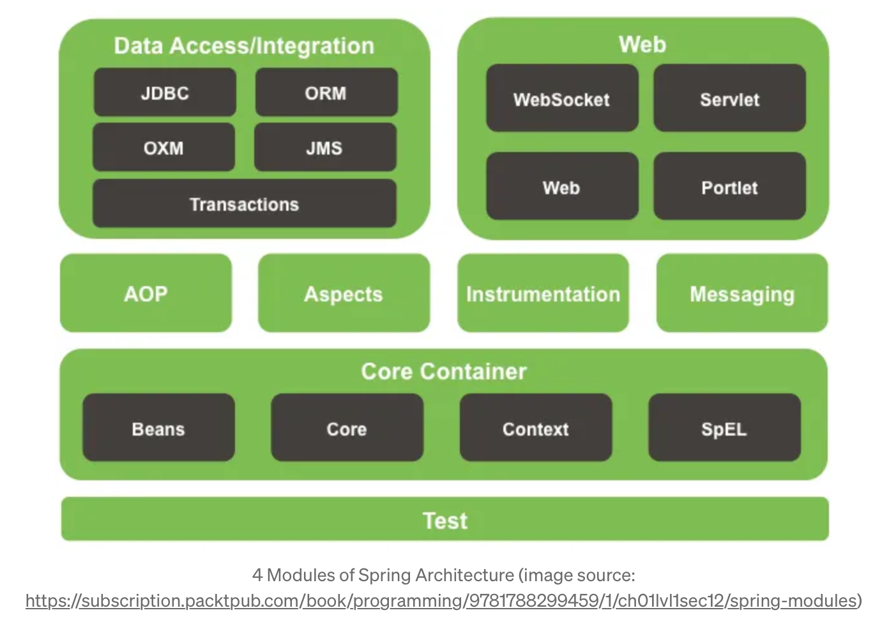
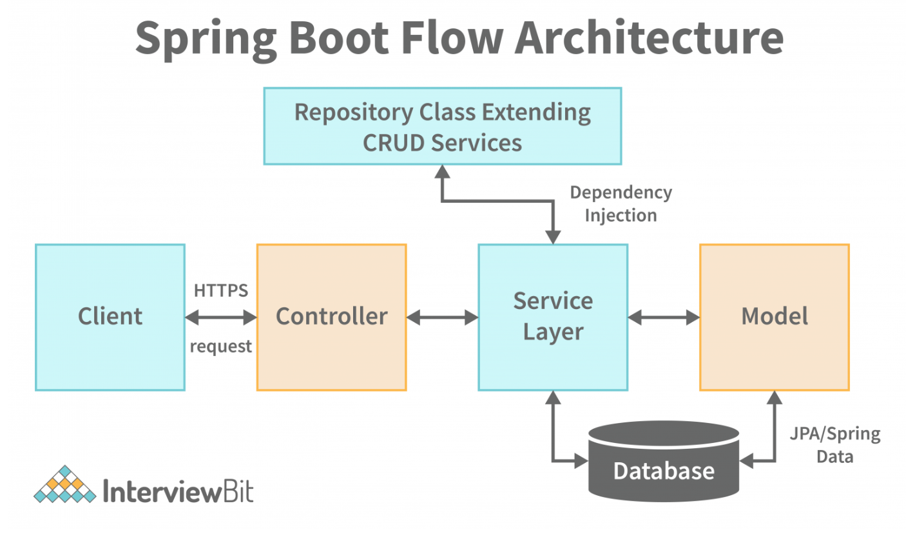

# CICD


# Spring



- Spring beans
- 

# Web Application Architecture



# Architecture of this project

## Backend

- Controller: MVC controllers, where the endpoints are located to receive requests
- Services: business logic
- Repositories: data access (JPA)
  where the Dtos, entities and repositories are located, i.e. everything for interacting with the data and the database
  - model
  - dots
  - entities
- DataInitializer: which contains command line runners that fill the database with data for testing.
- Deserializer: where the JSONs of the frontend are transformed into Dto in order to be able to work better with the data
- Exceptions: where custom exceptions are defined which can be forwarded to the frontend as error messages
- Security: where everything for authentication and authorization of users is located (own controller, service and repository included)

# Backend

## Main class

the class annotated with `@SpringBootApplication`  

```java
@SpringBootApplication
public class BackendApplication {
	public static void main(String[] args) {
		SpringApplication.run(BackendApplication.class, args);
	}
}
```

## Controllers

### Functions of controller layer

- **Handles HTTP Requests**: Maps incoming requests (GET, POST, PUT, DELETE) to specific methods.
- **Parses Input**: Extracts data from URLs, headers, path variables, query parameters, and request bodies.
- **Invokes Business Logic**: Delegates processing to the service layer.
- **Returns Responses**: Converts results into HTTP responses (JSON, XML, HTML, etc.).
- **Manages Exceptions**: Handles errors and returns appropriate status codes (e.g., 404, 500).

### Annotations

- `@RestController`: marks the class as a REST API controller, which returns JSON/XML files
- `@Transactional`: If updating the status or approvals fails, all changes (e.g., status, approvals, application data) are rolled back, which ensures atomicity
  - what is roll back?
- `@RequestBody`: Take the JSON (or other format) in the HTTP request body and convert it into an instance of the specified class, then pass that object into the method parameter

### Communication between Frontend and Backend

1. Frontend makes a request (want to add, update, delete...)

   - the frontend typically send a HTTP request to the backend using HTTP client library

     ```javascript
     fetch("https://example.com/application/saveEdited", {
       method: "PUT",
       headers: {
         "Content-Type": "application/json"
       },
       body: JSON.stringify({
         applicationID: "123",
         // other fields in the EditedApplicationDto
       })
     })
       .then(response => {
         if (response.ok) {
           // Handle success
         } else {
           // Handle error
         }
       })
       .catch(error => {
         // Network error or similar
       });
     ```

     

2. Backend notice that this request is looking for a controller method annotated with `@PutMapping("/saveEdited")"`

3. When backend find it, it will **deserialize** the JSON file from frontend request into the method parameter using `@RequestBody` 

4. Excute the controller method

5. the controller returns a repsonse back to Frontend

   - `ResponseEntity<?>` : be used to construct the HTTP response

## Repositories

### Dto

- transfer data between client and server to keep safty of data
- 

# Frontend (Vue)

## package.json

in `package.json` you can find how to start the vue app and all dependencies it needs

## Axios

to be used in vue to make HTTP requests from web 

- How is the proxy design in vue app? in our project we use nginx


